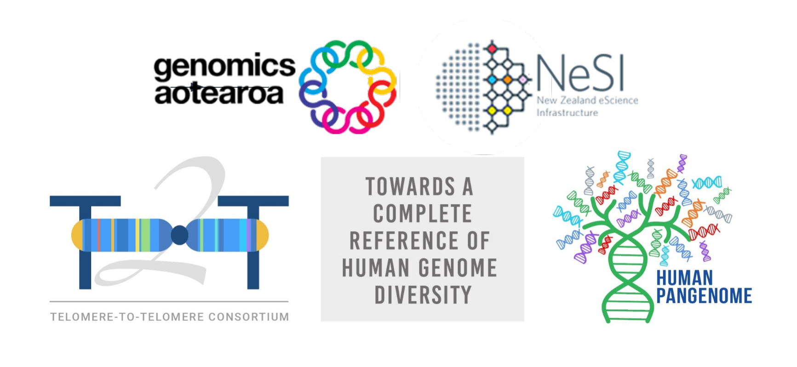
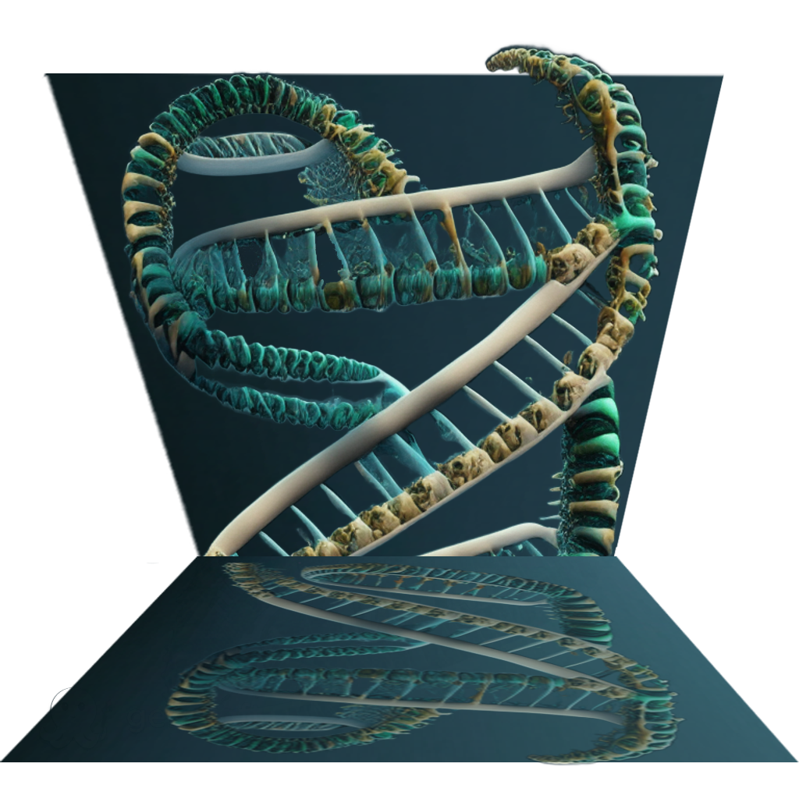

{width="500"}

# **Long-read Assembly**

{width="300"}

!!! calendar-days "Workshop schedule"

    | Day                 | Time    | Lesson overview                                                                 |
    | :------------------ | :------ | :----------------------------------------------------------------------- |
    | Tuesday, 4th July   | 1:00PM   2:00PM   3:00PM | [Introduction to the workshop](pages/day0_intro.md)   [How are assemblies created?](pages/day1a_read_inputs.md)   [Familiarize Ourselves with the Data](pages/day1b_familiarise_w_data.md)   Talk by Assistant Professor Karen Miga |
    | Wednesday, 5th July | 9:00AM   12:00PM   1:00PM   2:00PM   3:00PM | [Assembly](pages/day2a_assembly.md)   Lunch break   [Assembly continued](pages/day2a_assembly.md)   Talk by Dr Brandon Pickett   Talk by Dr Joseph Guhlin                                      |
    | Thursday, 6th July  | 9:00AM   10:00AM   11:00AM   12:00PM   1:00PM  | [Assembly QC](pages/day3a_assembly_qc.md)   [Assembly clean-up](pages/day3b_assembly_cleanup_annotation.md)   [Phased assemblies in action](pages/day3c_phased_assemblies_in_action.md)   Lunch break   Talk by Assistant Professor Benedict Paten                              |
  

??? example "Supplementary materials"

    | Supplementary   | Topic                                                                                      |
    | :-------------- | :----------------------------------------------------------------------------------------- |
    | Supplementary 1 | [NeSI HPC Authentication Factor Setup and Jupyter Login](supplementary/supplementary_1.md) |
    | Supplementary 2 | [NeSI File System, Working Directory, and Symlinks](supplementary/supplementary_2.md) |

!!! copyright "Attribution notice"

    - Material used to prepare for the workshop was extracted from https://github.com/human-pangenomics/hprc-tutorials/tree/GA-workshop
 

!!! book-atlas "References"

    - Lorig-Roach, Ryan, et al. "Phased nanopore assembly with Shasta and modular graph phasing with GFAse." *bioRxiv* (2023): 2023-02.

    - Porubsky, David, et al. "Fully phased human genome assembly without parental data using single-cell strand sequencing and long reads." *Nature biotechnology* 39.3 (2021): 302-308.