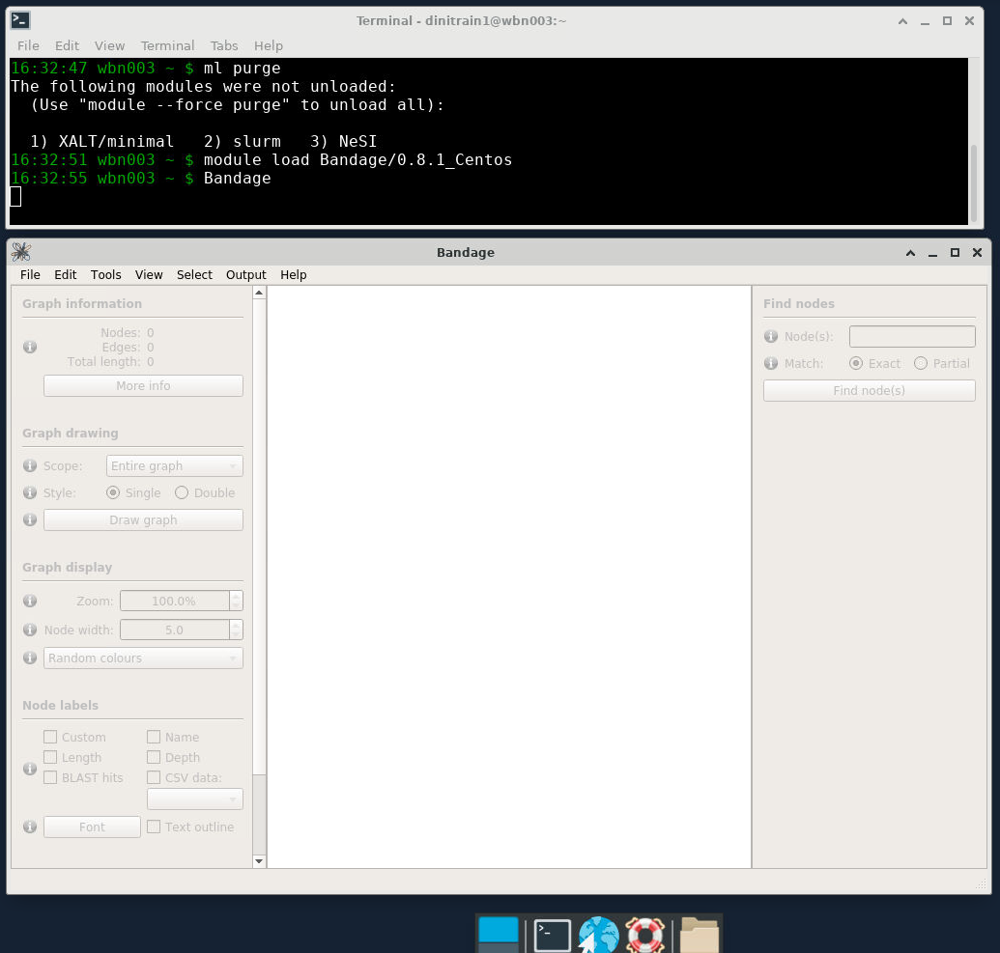

# 4. Assembly

!!! info "Here is a rundown of what we will do today:"

    * Learn about how Verkko & Hifiasm create assemblies
    * Run Hifiasm with test data (HiFi only)
    * Run Verkko with test data (HiFi + ONT)
    * See how to run both with full datasets
    * Compare the two assemblers
    * Talk about how much data we need 
    
At the end of the day you will hopefully have a feel for how to actually run each assembler, what data to give them, and when to choose one over the other.

## Theoretical Walkthrough Of The Assembly Process

### Verkko
In this section we will go over the rough outline of Verkko's approach to assembly. Hopefully this will help put the data types from yesterday in context. Knowing how each data type is used also helps you to make better decisions when planning your sequencing runs.

Both Verkko and Hifiasm can use a variety of data sources:

!!! quote ""

    * PacBio HiFi: >10kbp, around 99.9% accuracy
    * Oxford Nanopore Ultralong: >100kb, around 97% accuracy
    * Phasing data from Hi-C or trio Illumina data

PacBio HiFi data is required for both assemblers. Other data types are optional&mdash;but they lead to much better assemblies. So let's jump ahead a bit and take a peak at how Verkko creates assemblies using figure 1 from the recent Verkko paper (Rautiainen, Mikko, et al.). It's ok if this is a bit confusing, you don't need to know the inner workings of Verkko in order to make great assemblies.

**PacBio HiFi is used to create the initial graph** 

Verkko's first theoretical task is to create an assembly graph from HiFi data, but it has to prepare the HiFi reads first. HiFi data is less accurate in homopolymer repeats and microsatellites, so before creating an assembly graph, the reads are "compressed" in these regions:
<p align="center">
    
</p>

The reads are then error corrected. You don't have to worry about how this works (just know that it is very computationally intensive). Once that is done, a graph is created from the HiFi reads:

<p align="center">
    
</p>

If you aren't familiar with what an assembly graph is, that is also ok! The annoying thing is that there are different ways to make assembly graphs, but they all have the common feature of linking together reads by their overlaps. In this graph the boxes (also called nodes) represent sequences and the lines (also called edges) represent the relationship between those overlaps.

Note that in the middle section the orange and blue lines represent the ONT reads aligned to the graph. 

**Oxford Nanopore Data (which is long) helps simplify the graph**

Using these alignments, nodes that are linked (or phased) by a read are combined. This "simplifies" the graph -- in other words, you get nice long nodes where you previously had shorter nodes. (Long nodes are good, they mean you have longer sequences that are assembled.)

<p align="center">
    
</p>

**The graph can now be phased**

In the case of trio Illumina data, Verkko looks at the nodes and counts the number of maternal-specific or paternal-specific sequences of DNA (from meryl hapmer DBs). If it finds that a node has, for instance, a bunch of maternal specific sequences/*k*-mers and almost no paternal specific sequences/*k*-mers then the assembler will assign that node to be maternal. Nodes that are the same haplotype but are separated by a homozygous region are then merged.

<p align="center">
    
</p>

Finally the assembly graph can be converted into two contigs which represent maternal and paternal haplotypes.

<p align="center">
    
</p>

Maternal and paternal contigs for the entire assembly are then put into one diploid FASTA as well as two haploid FASTAs.

!!! info "How does Hi-C phasing work?"

    Like using trio data, Hi-C phasing aims to find nodes that are near to each other and come from the same haplotype. To achieve this, Hi-C data is aligned to the graph and reads that are linked across nodes can be used to phase the graph as shown in this figure modified from (Garg, Shilpa):
    <p align="center">
        
    </p>
    One key difference between trio phasing and Hi-C is that Hi-C data cannot say that a set of nodes all come from the sample's mother or father, only that they come from the same haplotype. 


## Exploring With Test Data
Running assemblers is very computationally intensive and the output files can be big. Let's not jump straight into assembling human genomes. Instead we can use the test data that both assemblers provide as a way to both ensure that we know how to run the tool (which is easy) and we can start to get a feel for the process and outputs in real life. 

### Run Hifiasm With Test Data

**Create a directory**

!!! terminal "code"
    
    ```bash
    cd ~/lra
    mkdir -p day2_assembly/hifiasm_test
    cd day2_assembly/hifiasm_test
    ```

**Now download Hifiasm's test data**

!!! terminal "code"

     ```bash
     wget https://github.com/chhylp123/hifiasm/releases/download/v0.7/chr11-2M.fa.gz
     ```
This is HiFi data from about 2 million bases of chromosome 11. HiFi data is the only required data type for Hifiasm and Verkko. You can create assemblies from only HiFi data and you can add ONT and phasing later. Also notice that this data is in FASTA format! Presumably this is to make the file smaller since this is test data.

**Now let's load the Hifiasm module**

!!! terminal "code"

    ```bash
    module purge
    module load hifiasm
    ```
And actually run the test data

!!! terminal "code"

    ```bash
    hifiasm \
        -o test \
        -t4 \
        -f0 \
        chr11-2M.fa.gz \
        2> test.log &
    ```
This should take around 3 minutes. Once the run is complete take a look at the top of the log:

!!! terminal "code"

    ```bash
    head -n 60 test.log
    ```
Now check the [Hifiasm log interpretation](https://hifiasm.readthedocs.io/en/latest/interpreting-output.html#hifiasm-log-interpretation) section of the documentation to give that some context.

??? question "What does the histogram represent, and how many peaks do you expect?"
        
    The histogram represents the *k*-mer count in the HiFi reads. For humans we expect to see a large peak somewhere around our expected sequencing coverage: this represents homozygous *k*-mers. The smaller peak represents heterozygous *k*-mers.


Now `ls` the directory to see what outputs are present. What do you see? No FASTA files, but there are a lot of files that  end in `gfa`. If you haven't seen these before, then we get to introduce you to another file format! 

### Introduction To GFA Files
GFA stands for [Graphical Fragment Alignment](http://gfa-spec.github.io/GFA-spec/GFA1.html) and Hifiasm outputs assemblies in GFA files. GFAs aren't like bed or sam files which have one entry per line (or FASTA/Q that have 2/4 lines per entry). But this is bioinformatics, so you can rest assured that it is just a text file with a new file extension. It's easiest to just look at an example of a GFA file from the spec:

```bash
H    VN:Z:1.0
S   11  ACCTT
S   12  TCAAGG
S   13  CTTGATT
L   11  +   12  -   4M
L   12  -   13  +   5M
L   11  +   13  +   3M
P   14  11+,12-,13+ 4M,5M
```
!!! info "Here we see the following line types"

    * H (Header): File header. You get the idea.
        * The example here the header is just saying that the file follows GFA 1.0 spec. 
        * Notice that this line follows a TAG:TYPE:VALUE convention. Type in this case is Z which corresponds to printable string. 
    * S (Segment): A sequence of DNA
        * This is what we care about for the moment!
    * L (Link): Overlap between two segments
        * We can read the first Link line as saying that the end of Segment 11 (+) connects to the beginning of Segment 12 (-) and the overlap is 4 matching bases. In this case it would look like this:
        
    ```bash
        ACCTT    (Segment 11)
         ||||
         GGAACT  (Segment 12 -- reversed)
    ```

    * P (Path): Ordered list of segments (connected by links)

**So how do we get a FASTA from a GFA?**<br>
To get a FASTA we just pull the S lines from a GFA and print them to a file:

!!! terminal "code"
    ```bash
    awk '/^S/{print ">"$2;print $3}' \
        test.bp.p_ctg.gfa \
        > test.p_ctg.fa 
    ```

!!! info "You can read this awk command as:"

    1. Give me all input lines that start with `S` 
    2. Then print the second column of those lines (which is the sequence ID) 
    3. Also print another line with the actual sequence
    
??? question "Why does Hifiasm output GFAs and not FASTAs?"
  
    Hifiasm (and many other assemblers) use GFAs while they are actually assembling. The GFA represents/stores the assembly graph. Hifiasm probably doesn't output FASTAs just because everything in the FASTA is contained in the GFA, so why store it twice?


### View Hifiasm Test Assembly GFA in Bandage
We are going to take a look at the assembly GFA file in a browser called Bandage. Bandage provides a way to visualize something called unitig graphs.

!!! jupyter "Start Bandage"

    1. Open Jupyter Virtual Desktop [according to these instructions](../supplementary/supplementary_3.md)
    2. In the Virtual Desktop, click on the terminal emulator icon (in your toolbar at the bottom of your screen)
    3. Load the Bandage module with `module load Bandage`
    4. Type `Bandage &` to start Bandage
       {width="600"}
    
    **Load a unitig GFA**
    
    1. Click the *File* dropdown then *Load Graph*
    2. Navigate to our current folder (`day2_assembly/hifiasm_test`)
    3. Select the `test.bp.r_utg.noseq.gfa` file and press the **Open** icon
    4. Under **Graph Drawing** on the left-hand side click **Draw Graph**
    
    Ok, so what are we looking at? The thick lines are nodes&mdash;which in this case represent sequences. Since we loaded the unitig graph the sequences are unitigs. A unitig is a high confidence contig. It is a place where the assembler says "I know exactly what is going on here". The ends of unitigs are where it gets messy. At the ends, an assembler has choices to make about which unitig(s) to connect to next.
    
    **Now load a contig GFA**<br>
    Open the `test.bp.p_ctg.noseq.gfa` file to see how boring it is.
    
    In general, when using Bandage people look at the unitig GFAs (not contig GFAs). An assembly is a hypothesis, and the contigs output by the assembler are its best guess at the correct haplotype sequence. The contigs don't show much information about the decisions being made, however. They are the output. We view unitig GFAs so we can see the data structure at the point that the assembler was making tough decisions. 
    
    **Here are some things you can do with Bandage**
    
    1. Let's say you mapped a sample's ONT reads back onto that sample's *de novo* assembly and have identified a misjoin. You can open up bandage and find that  unitigs that went into the contig to see if it can be easily manually broken.
    2. If you have a phased diploid assembly with a large sequence that is missing, you can look at the unitig gfa, color the nodes by haplotype, and see which sequences are omitted. Those sequences can then be analyzed and manually added into the final assembly.
    3. You can label nodes with (HiFi) coverage and inspect regions with low quality too see if they have low coverage as well. If so, you might want to throw them out. (This does happen, in particular for small contigs that assemblers tend to output.)
    
    
## Run Verkko With Test Data
**Create a directory**

!!! terminal "code"

    ```bash
    cd ~/lra
    mkdir -p day2_assembly/verkko_test
    cd day2_assembly/verkko_test
    ```

**Now download Verkko's test data**<br>

!!! terminal "code"

    ```bash
    curl -L https://obj.umiacs.umd.edu/sergek/shared/ecoli_hifi_subset24x.fastq.gz -o hifi.fastq.gz
    curl -L https://obj.umiacs.umd.edu/sergek/shared/ecoli_ont_subset50x.fastq.gz -o ont.fastq.gz
    ```
You can see that this dataset is for *E. coli* and there is both HiFi and ONT data included.

We could follow what we did with Hifiasm and just run Verkko in our notebook environment like so:

!!! terminal "code"

    ```bash
    module purge
    module load verkko/1.3.1-Miniconda3
    
    verkko \
        -d asm \
        --hifi ./hifi.fastq.gz \
        --nano ./ont.fastq.gz
    ```
However, depending on how you created your notebook environment this command may crash it. That's ok, it gives us an opportunity to test running Verkko with Slurm.

**Create Slurm script for test Verkko run**

Start your favourite text editor

!!! terminal "code"

    ```bash
    nano verkko_test.sl
    ```
    
    And then paste in the following

    ```bash
    #!/bin/bash -e
    
    #SBATCH --account       nesi02659
    #SBATCH --partition     milan
    #SBATCH --job-name      test_verkko
    #SBATCH --cpus-per-task 8
    #SBATCH --time          00:15:00
    #SBATCH --mem           24G
    #SBATCH --output        slurmlogs/%x.%j.log
    #SBATCH --error         slurmlogs/%x.%j.err
    
    ## load modules
    module purge
    module load verkko/1.3.1-Miniconda3
    
    
    ## run verkko
    verkko \
        -d assembly \
        --hifi ./hifi.fastq.gz \
        --nano ./ont.fastq.gz
    ```

    **Run verkko test**
    ```bash
    sbatch verkko_test.sl
    ```
This should only take a few minutes to complete.

You can keep track of the run with the `squeue` command.

!!! terminal "code"
    
    ```bash
    squeue --me
    ```

**How does Verkko run?**

It turns out that if you run Verkko more than once or twice you will have to know a bit about how it is constructed. Verkko is a program that reads in the parameters you gave it and figures out a few things about your verkko installation and then creates a configuration file (`verkko.yml`) and a shell script (`snakemake.sh`). The shell script is then automatically executed.

Take a look at the shell script that was created for your run

!!! terminal "code"

    ```bash
    cat assembly/snakemake.sh
    ```

It is just a call to Snakemake!!! You can think of Verkko as a tool, but also as a pipeline because it is. This has some advantages. One is that if you know what Verkko is doing (which is somewhat achievable given that the Snakemake rules guide you through Verkko's logic), you can add to it, or even swap out how Verkko performs a given step for how you'd like to do it. It also means that you can restart a run at any given step (if you made a mistake or if the run failed). Lastly, and maybe most importantly, Snakemake supports Slurm as a backend. So if you have access to an HPC you could (and probably should) run Verkko and allow it to launch Slurm jobs for you. (This is in contrast to what we just did which was to run a Slurm job and just allow all jobs to run on the allocated resources that we requested for the entire run.)

**Now take a look at the jobs that were run**

You can view the stderr from the run in your Slurm logs, or in Snakemake's logs. Let's take a look at the top of the log:

!!! terminal "code"

    ```bash
    head -n 35 assembly/.snakemake/log/*.log
    ```
This shows a list of Snakemake jobs that will get executed for this dataset. There are a few things to note. The first is that for larger datasets some jobs will get executed many times (hence the count column). This dataset is small, so most jobs have `count=1`. The second thing to note is that these jobs are sorted alphabetically, so we can get a feel for scale, but it's a bit hard to figure out what Verkko is really doing.

Open the logs and scroll through them

!!! terminal "code"

    ```bash
    less asm/.snakemake/log/*.log
    ```
You can see all of the Snakemake jobs, in order, that were run. Even for this tiny dataset there are many. Since there are a lot of jobs, there are a lot of outputs, and these are organized (roughly) by Snakemake rule. Take a look at the output folder in order to familiarize yourself with the layout.

!!! terminal "code"

    ```bash
    ls -lh assembly
    ```

**Take a look at the initial HiFi graph**

Open the `assembly/1-buildGraph/hifi-resolved.gfa` file in Bandage. You will see that it is already pretty good. There are only three nodes.

**Now take a look at the ONT resolved graph**

Open the `assembly/5-untip/unitig-normal-connected-tip.gfa` file in Bandage. Now our three nodes have been resolved into one. 


## Comparison of Computational Cost

### Hifiasm

Hifiasm is compiled into a single binary file, and, when executed, it manages all tasks and parallelism under one parent process. You can run it the same on a VM in the cloud or in an HPC. 

For a human sample with around 40X HiFi and 30X UL and either HiC or trio phasing Hifiasm can assemble with:

* 64 cores
* 240GB of memory (most samples will use less)
* Around 24 hours of total runtime

So Hifiasm takes about 1500 CPU hours to assemble this sample. On a cluster you can just execute the run command. If you are on a cloud and would like to take advantage of pre-emptible instances, you can break the run command into three parts (each take around 8 hours).


### Verkko

Verkko is written as a shell wrapper around a Snakemake pipeline. This has the advantages of easily restarting after failures and increased potential for parallelism in an HPC environment with multiple nodes available, but it is hard to profile all the individual tasks. If the cluster is not too busy a human assembly can finish in around a day. Most of the compute is done in the overlap and graph aligner jobs. So we can break the runtimes into steps that revolve around the big jobs. That looks something like this:

| <sub>**Step**</sub> | <sub>**CPUs**</sub> | <sub>**Shards**</sub> | <sub>**Time/Shard (est)**</sub> |<sub>**Total CPU Hours**</sub> |
| :-------- | :-------- | :------ | :------ | :------ |
| <sub> pre overlap </sub> | <sub> 24 </sub> | <sub> 1 </sub> | <sub> 3 </sub> |<sub> 72 </sub> |
| <sub> overlap </sub> | <sub> 8 </sub> | <sub> 600 </sub> | <sub> 1 </sub> |<sub> 4800 </sub> |
| <sub> create graph </sub> | <sub> 80 </sub> | <sub> 1 </sub> | <sub> 13 </sub> |<sub> 1040 </sub> |
| <sub> graph aligner </sub> | <sub> 12 </sub> | <sub> 100 </sub> | <sub> 2 </sub> |<sub> 2400 </sub> |
| <sub> complete asm </sub> | <sub> 64 </sub> | <sub> 1 </sub> | <sub> 12 </sub> |<sub> 768 </sub> |

This gives an estimate of around 9000 CPU hours for the same data as above. This is almost certainly an overestimate, but not by more than a factor of 2. 

Note that the runtime estimates for Hifiasm and Verkko don't consider the preparatory work of counting parental *k*-mers with yak or Meryl, which are necessary steps before running either in trio mode.

## Comparison of Outputs

Verkko and Hifiasm are both excellent assemblers. If you have a human sample with over 40X HiFi and over 15X ONT data over 100kb then the high level metrics that you will learn about tomorrow should be pretty comparable across the two assemblers. If you have a set of data that you spent a bunch of money on, and you are hoping to make a high-quality assembly, your best bet is to assemble with both and see which assembly is better. You could even stitch the good parts of each assembly together&mdash;though the people who have to do the actual work tend to flinch when they hear that.


### Verrko's Approach
As we saw previously, Verkko uses HiFi data to create a graph (in the case of Verkko it is a DeBruijn graph). ONT reads are aligned to the graph and the graph is then simplified. One thing that Verkko does is it outputs scaffolds&mdash;where Hifiasm only outputs contigs. With 40X+ HiFi, Verkko's scaffolding tends to add about 12 extra T2T chromosomes to a diploid human assembly. 

The way it is scaffolded comes from the graph (as shown below). One the left we see one haplotype and there is a tangle in the middle of the sequence. Verkko doesn't necessarily know how to walk through this tangle and it doesn't want to output incorrect sequence. So it just estimates the size of the nodes in the tangle and puts the corresponding number of N's into the final assembly. Similarly, on the right we have a gap in one haplotype. Verkko will infer the size of the missing sequence from the other haplotype and put that many N's into to top sequence.

<p align="center">
    
</p>

This has led some people (well at least one person) to call this approach grapholding. 

### Hifiasm's Approach

Hifiasm creates string graphs from HiFi and ONT data separately (kind of) and then combines them. The argument here is that by creating a standalone ONT graph you don't risk losing information that may be missing in the HiFi-only graph. At the time moment (July 2023) Hifiasm does not include a scaffolding step. Though that will likely change in the coming months.

### How Should I Choose?

**It's not an easy choice, but here are some guidelines**

* If you can, use both
* If you have Hifi coverage under 40X: use Hifiasm
    * Verkko tends to perform less well at lower HiFi coverages
* If you have to pay for compute time: use Hifiasm (see the previous section)
    * Verkko is more expensive to run. If you are on an HPC that may be ok. If you are paying Amazon for your compute then Verkko assemblies can cost upwards of $300 (USD).
* If you want to assemble then fiddle with it to perfect the assembly: use both, then fix things with Verkko
    * Verkko allows you to see its inner workings. You can also make manual changes and then restart from that point in the assembly process. If you do things right, Verkko will take care of the rest. This was done, for instance, by the Verkko team on their version of the HG002 assembly: they manually resolved tangles in the graph.

## How Much Input Data Do I Need?

Let's do some back of the envelope math to see how much is an ideal amount of data that would go into an assembly...

**PacBio HiFi**

Computing overlaps isn't so different from calling variants. For each haplotype we probably want around 10X coverage in order to calculate good overlaps. So that would give about 20X total. But HiFi coverage is variable, and there are some well know regions (such as GA repeats) that drop out of HiFi data. In order to get as many regions as possible above the threshold for assembly we increase the value to 40X.

**ONT UL**

The answer to this depends on who you ask. In the case of Verkko you are often just looking for one or a handful of reads to span a tricky region in the graph. The Verkko team has shown that coverages over 15X of 100kb+ reads don't add much in terms of contiguity. (Though for advanced applications such as using ONT to fill-in missing parts of the graph the math may be different.)

**Trio and Hi-C**

In general the better your graph, the easier it is to phase. If you have only a few big bubbles in the graph, it is a lot easier to find Illumina data that will map to them in a haplotype-specific way. This hasn't been tested rigorously, but people tend to talk about 30X for these datasets.


 